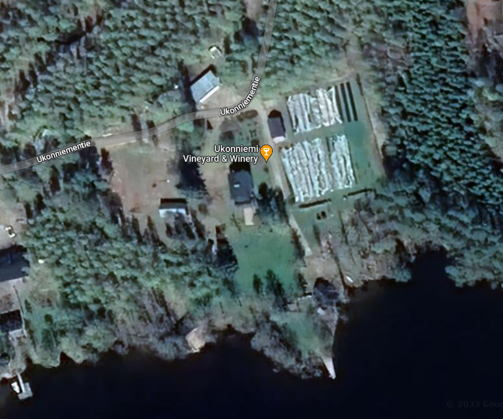
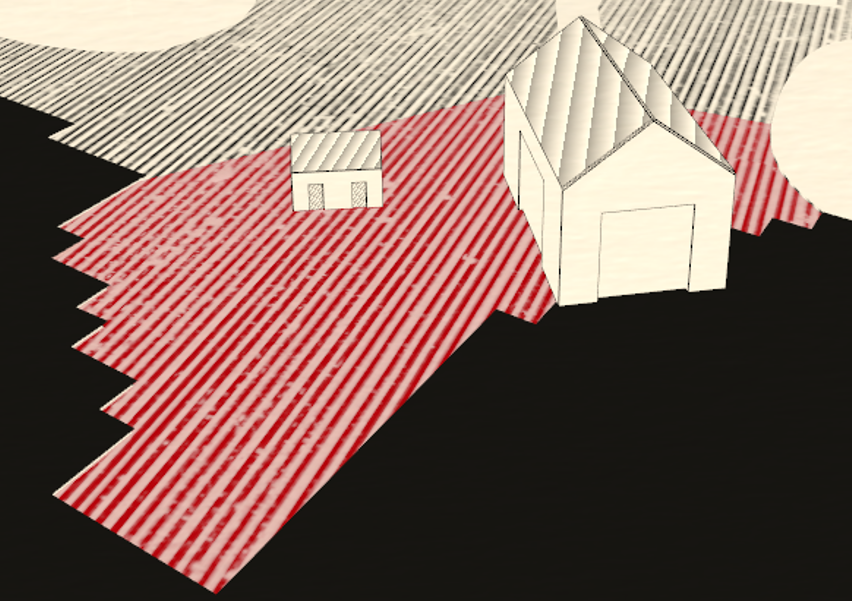
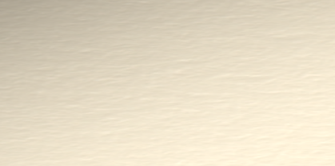
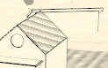

- Project Time: 5 days
- Main Techstack: React, React Three Fiber, React Postprocessing, Postprocessing and custom Shaders, Vite Bunlder, MantineUI
- Super fast loading Time on the Web and very decent on Mobile (Iphone 6s)

The goals was to create something simliar to https://chartogne-taillet.com/en one of the best WebGL Experiences on the Web that I know.
The theming really fits well to Vinemakers and its done from a French Team called https://immersive-g.com/ based in Paris.
I wanted to reproduce this outcome, the challenge was that I am a single Programmer and do not have that much time and also there is little information on how they have achieved such an outcome. This is the only helpful information I could find to this
project: https://medium.com/@hello_11138/chartogne-taillet-experience-site-case-study-53431d5f75f7. Reengineering the shader code is possbile
since this code does not get minified, but its is more useful to use your time to think on your.

## 1. Make a 3D Model

I do use Blender, keep the amout of Vertecies low, watch out for dublicated Vertecies (Merge by Distance)
checkt that the normals are facing into the right direction an export everything as a compressed glb.
The rest is on your creativiy, for this Project i used a Google Maps Screenshot as a reference.
I ended up with almost 54.000 Vertices, sounds like a lot but THREE.js can handle that pretty well.
Also adding some details here an there to the models make the Page look more interesting


reference:



## 2. React + React Fiber

I do use React Fiber for smaller Projects like this, because it really speeds up the Development Process
a lot, since its an abstraction layer on top of THREE.js.
If you are concerned about the performance, which I had been too, because the nature is
to rerender parts of the application on props/state change and WebGL doesn't like rerenderings
you should watch this interview with Paul Henschel from the "pmnd" team (react three fiber):
https://www.youtube.com/watch?v=rzhCVvacvMo&ab_channel=KendoUI

## 3. Postprocessing

After importing the Models to the Scene it will probably look like in Blender or even worse.
You can will the scene with baked materials from Blender or make them on your own with a THREE.js Material
But this will use rescources especially when you do not instanciate dublacte meshes.
I do not have instanciated the threes in this project either because there are not a lot
but for my webpage karhukoding.de its very userful because this page is alreay expensice enought.

So to achieve this the scene runs throug severy ShadersPasses to alter the look of the whole scene.
You can implement this with https://docs.pmnd.rs/react-postprocessing/introduction.
this package is based on https://github.com/pmndrs/postprocessing.

Passes that I use:

- Vignette
- Outline
- custom Sepia
- custom Texture

The Vignette and Outline pass are taken from the libraries mentiones above.
The Vignette Pass is responsible for the dark corners of the Scene.
Outline is used in the Mobile view to highlight the elements the User is suposed to interact with.

Custom Passes:

- SepiaPass:
  you can create a Sepia Pass with following Shader

```
const fragmentShader = /* glsl */ `
	void mainImage(const in vec4 inputColor, const in vec2 uv, out vec4 outputColor)
        {
		vec3 sepia_color = vec3(
				dot(inputColor.rgb, vec3(0.393, 0.769, 0.189)),
				dot(inputColor.rgb, vec3(0.349, 0.686, 0.168)),
				dot(inputColor.rgb, vec3(0.272, 0.534, 0.131))
		);

   		vec3 color = mix(inputColor.rgb, sepia_color, delta);

		outputColor =  vec4(color, inputColor.a);
		}
`;
```

The challange was to tint the whole scene into a sepia color, but keep the red color for
the hoverable areas.
This is a Problem becaus a simple Sepia Pass would also tint the scene complete so there would be no
red color or the red color would look like a darkish color
You can create a new Scene which would not be affected by the the Effects run in the other scene,
but you would end up with a depth problem, so the red areas would cover the Objects of our Main Scene.
How i solved the Problem I do keep for myself since I also want to sell my knowledge but I am sure you will
find out.



Texture Pass:

If you look close you can the a paper texture on top of the Scene. There is no for that provided by
react-postprocessing, i did implemented it on my own to React
from https://github.com/pmndrs/postprocessing/blob/main/src/effects/TextureEffect.js
and simplyfied it for my needs.
I do use the BlendFunction.DIVIDE blend function



## 4. Outline

The outline seen on the Houses is done with
https://threejs.org/docs/#api/en/geometries/EdgesGeometry, its good enough also with efficeny back mind but if you want to go fancy you can go with a nice Sobel Edge Detection:

<details>
  <summary>See Code</summary>
  
 
  ```js
  uniforms: {

    	"tDiffuse": { value: null },
    	"resolution": { value: new THREE.Vector2() }

    },

    vertexShader: [

    	"varying vec2 vUv;",

    	"void main() {",

    		"vUv = uv;",

    		"gl_Position = projectionMatrix * modelViewMatrix * vec4( position, 1.0 );",

    	"}"

    ].join( "\n" ),

    fragmentShader: [

    	"uniform sampler2D tDiffuse;",
    	"uniform vec2 resolution;",
    	"varying vec2 vUv;",

    	"void main() {",

    		"vec2 texel = vec2( 1.0 / resolution.x, 1.0 / resolution.y );",

    		// kernel definition (in glsl matrices are filled in column-major order)

    		"const mat3 Gx = mat3( -1, -2, -1, 0, 0, 0, 1, 2, 1 );", // x direction kernel
    		"const mat3 Gy = mat3( -1, 0, 1, -2, 0, 2, -1, 0, 1 );", // y direction kernel

    		// fetch the 3x3 neighbourhood of a fragment

    		// first column

    		"float tx0y0 = texture2D( tDiffuse, vUv + texel * vec2( -1, -1 ) ).r;",
    		"float tx0y1 = texture2D( tDiffuse, vUv + texel * vec2( -1,  0 ) ).r;",
    		"float tx0y2 = texture2D( tDiffuse, vUv + texel * vec2( -1,  1 ) ).r;",

    		// second column

    		"float tx1y0 = texture2D( tDiffuse, vUv + texel * vec2(  0, -1 ) ).r;",
    		"float tx1y1 = texture2D( tDiffuse, vUv + texel * vec2(  0,  0 ) ).r;",
    		"float tx1y2 = texture2D( tDiffuse, vUv + texel * vec2(  0,  1 ) ).r;",

    		// third column

    		"float tx2y0 = texture2D( tDiffuse, vUv + texel * vec2(  1, -1 ) ).r;",
    		"float tx2y1 = texture2D( tDiffuse, vUv + texel * vec2(  1,  0 ) ).r;",
    		"float tx2y2 = texture2D( tDiffuse, vUv + texel * vec2(  1,  1 ) ).r;",

    		// gradient value in x direction

    		"float valueGx = Gx[0][0] * tx0y0 + Gx[1][0] * tx1y0 + Gx[2][0] * tx2y0 + ",
    			"Gx[0][1] * tx0y1 + Gx[1][1] * tx1y1 + Gx[2][1] * tx2y1 + ",
    			"Gx[0][2] * tx0y2 + Gx[1][2] * tx1y2 + Gx[2][2] * tx2y2; ",

    		// gradient value in y direction

    		"float valueGy = Gy[0][0] * tx0y0 + Gy[1][0] * tx1y0 + Gy[2][0] * tx2y0 + ",
    			"Gy[0][1] * tx0y1 + Gy[1][1] * tx1y1 + Gy[2][1] * tx2y1 + ",
    			"Gy[0][2] * tx0y2 + Gy[1][2] * tx1y2 + Gy[2][2] * tx2y2; ",

    		// magnitute of the total gradient

    		"float G = sqrt( ( valueGx * valueGx ) + ( valueGy * valueGy ) );",

    		"gl_FragColor = vec4( vec3( G ), 1 );",

    	"}"

    ].join( "\n" )

```
</details>

<hr />
5. Roof Material


I created a custom Shader Material, added some stripes and rotated them using following
rotation matrix:
```
    mat2 rotate2d(float angle){
      return mat2(cos(angle),-sin(angle),
                  sin(angle),cos(angle));
}
```



5. Improvements

    - Baking Shadows into the Scene in Blender, would problably make a nice visual improvbement
    - Sobel edge Detection
    - Adding Wind animation in the Trees:
    You could rotate the meshed with react three fiber by accessing the refs and the useFrame Hook from react three fiber

```
     useFrame((state, delta) => (ref.current.rotation.x += delta))
```

<strong>Our better you use a custom Vertex Shader, you can use mine </strong>:
https://gist.github.com/KarhuKoding/ab1d00cb353be7a0bc35e76936288bce

this is based on a 3D rotation Matrix https://en.wikipedia.org/wiki/Rotation_matrix


<hr/>

Thanks for reading, if you are interessted in a Webpage like this our have question you can write me
on LinkedIn: https://www.linkedin.com/in/johannes-walenta-6a3857112/

### Greeting Johannes as KarhuKoding


