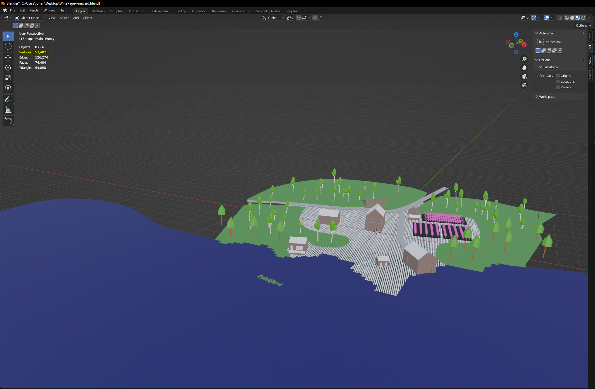
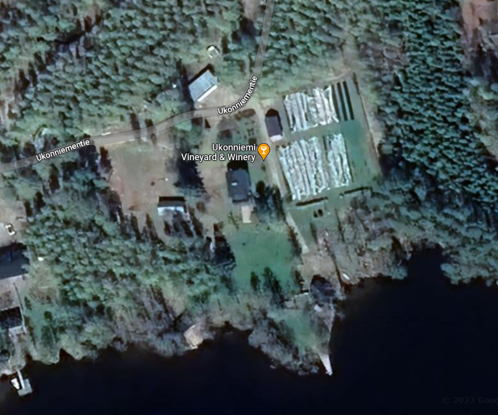
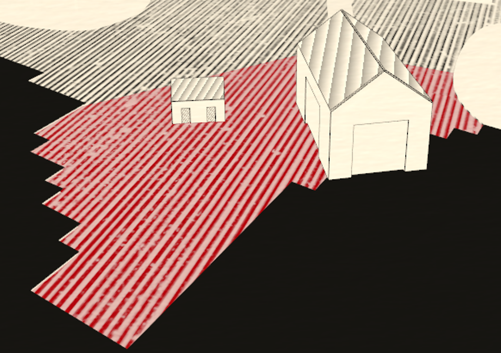
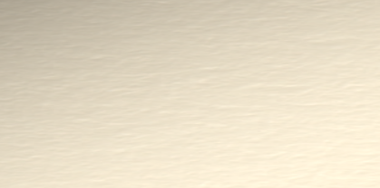
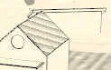
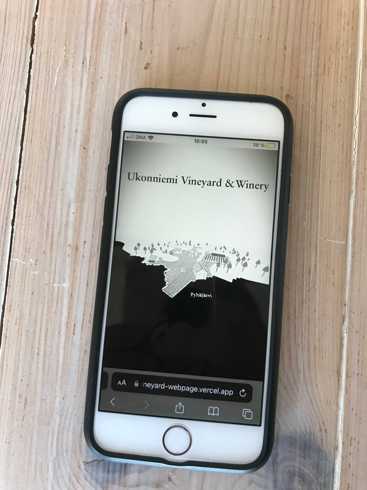
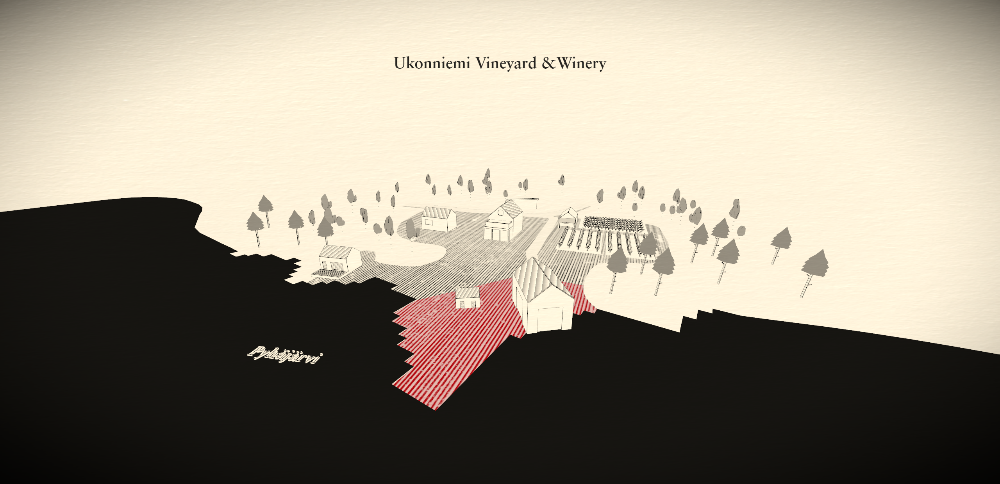

- Project Time: 5 days
- Main Techstack: React, React Three Fiber, Postprocessing and custom shaders, Vite Bunlder, MantineUI
- Super fast loading time on the web and very decent on mobile 

The goal was to create something similar to https://chartogne-taillet.com/en one of the best WebGL experiences that I know. The theming really fits well to Vinemakers and its done from a French Team called https://immersive-g.com/ based in Paris. I wanted to reproduce this outcome, but the challenge was that I am a single programmer and do not have that much time, and there is little information on how they have achieved such an outcome. This is the only helpful information I could find for this project: https://medium.com/@hello_11138/chartogne-taillet-experience-site-case-study-53431d5f75f7. Reengineering the shader code is possible since this code does not get minified, but it is more useful to use your time to think on your.

## 1. Make a 3D Model

I do use Blender, keep the number of verticies low, and watch out for dublicated verticies (Merge by Distance).
Check that the normals are facing in the right direction and export everything as a compressed "glb".
The rest is up to your creativity; for this project, I used a Google Maps screenshot as a reference.
I ended up with almost 54.000 Vertices, sounds like a lot but THREE. JS can handle that pretty well.
Also, adding some details here and there to the models makes the page look more interesting.



reference:



## 2. React + React Fiber (Three.JS) 😳

I do use React Fiber for smaller projects like this because it really speeds up the development process.
a lot, since it's an abstraction layer on top of THREE.JS.
If you are concerned about the performance, which I had been too, because the nature is
to rerender parts of the application when props or states change, and WebGL doesn't like renderings.
You should watch this interview with Paul Henschel from the "pmnd" team (react three fiber):
https://www.youtube.com/watch?v=rzhCVvacvMo&ab_channel=KendoUI

## 3. Postprocessing

After importing the models into the scene, it will probably look like it does in Blender, or even worse.
You can create the scene with baked materials from Blender or make them on your own with a THREE.JS Material.
But this will use resources, especially when you do not instanciate dublacte meshes.
I have not instantiated the threes in this project either, because there are not a lot.
But for my webpage, https://karhukoding.net/ it's very useful because this page is already expensive enough.
So to achieve this, the scene runs through several passes to alter the look of the whole scene.
You can implement this with https://docs.pmnd.rs/react-postprocessing/introduction.
This package is based on https://github.com/pmndrs/postprocessing.

Passes used:

- Vignette
- Outline
- custom Sepia
- custom texture


The Vignette and Outline Pass are taken from the libraries mentioned above.
The Vignette Pass is responsible for the dark corners of the scene.
Outline is used in the mobile view to highlight the elements the user is supposed to interact with.

#### Custom Passes:

- SepiaPass:
You can create a Sepia Pass with the following shaders code:

```
const fragmentShader = /* glsl */ `
	void mainImage(const in vec4 inputColor, const in vec2 uv, out vec4 outputColor)
        {
		vec3 sepia_color = vec3(
				dot(inputColor.rgb, vec3(0.393, 0.769, 0.189)),
				dot(inputColor.rgb, vec3(0.349, 0.686, 0.168)),
				dot(inputColor.rgb, vec3(0.272, 0.534, 0.131))
		);

   		vec3 color = mix(inputColor.rgb, sepia_color, delta);

		outputColor =  vec4(color, inputColor.a);
		}
`;
```

The challenge was to tint the whole scene with a sepia color but keep the red color for
the hoverable areas.
This is a problem because a simple sepia pass would also tint the scene, so there would be no
red color, or the red color would look like a darkish color.
You can create a new scene that would not be affected by the effects running in the other scene,
but you would end up with a depth problem, so the red areas would cover the objects in our main scene.
How I Solved the Problem I do keep it for myself since I also want to sell my knowledge, but I am sure you will
find out.



If you look closely, you can see a paper texture on top of the scene. There is no pass for that provided by react-postprocessing.
So I implemented on my own to React from https://github.com/pmndrs/postprocessing/blob/main/src/effects/TextureEffect.js and simplified it for my needs.

I do use the BlendFunction.DIVIDE blend function



## 4. Outline

The outline seen on the houses is done with
https://threejs.org/docs/#api/en/geometries/EdgesGeometry, its good enough also with efficeny back mind, but if you want to go fancy you can go with a nice Sobel Edge Detection:
 
  ```js
  uniforms: {

    	"tDiffuse": { value: null },
    	"resolution": { value: new THREE.Vector2() }

    },

    vertexShader: [

    	"varying vec2 vUv;",

    	"void main() {",

    		"vUv = uv;",

    		"gl_Position = projectionMatrix * modelViewMatrix * vec4( position, 1.0 );",

    	"}"

    ].join( "\n" ),

    fragmentShader: [

    	"uniform sampler2D tDiffuse;",
    	"uniform vec2 resolution;",
    	"varying vec2 vUv;",

    	"void main() {",

    		"vec2 texel = vec2( 1.0 / resolution.x, 1.0 / resolution.y );",

    		// kernel definition (in glsl matrices are filled in column-major order)

    		"const mat3 Gx = mat3( -1, -2, -1, 0, 0, 0, 1, 2, 1 );", // x direction kernel
    		"const mat3 Gy = mat3( -1, 0, 1, -2, 0, 2, -1, 0, 1 );", // y direction kernel

    		// fetch the 3x3 neighbourhood of a fragment

    		// first column

    		"float tx0y0 = texture2D( tDiffuse, vUv + texel * vec2( -1, -1 ) ).r;",
    		"float tx0y1 = texture2D( tDiffuse, vUv + texel * vec2( -1,  0 ) ).r;",
    		"float tx0y2 = texture2D( tDiffuse, vUv + texel * vec2( -1,  1 ) ).r;",

    		// second column

    		"float tx1y0 = texture2D( tDiffuse, vUv + texel * vec2(  0, -1 ) ).r;",
    		"float tx1y1 = texture2D( tDiffuse, vUv + texel * vec2(  0,  0 ) ).r;",
    		"float tx1y2 = texture2D( tDiffuse, vUv + texel * vec2(  0,  1 ) ).r;",

    		// third column

    		"float tx2y0 = texture2D( tDiffuse, vUv + texel * vec2(  1, -1 ) ).r;",
    		"float tx2y1 = texture2D( tDiffuse, vUv + texel * vec2(  1,  0 ) ).r;",
    		"float tx2y2 = texture2D( tDiffuse, vUv + texel * vec2(  1,  1 ) ).r;",

    		// gradient value in x direction

    		"float valueGx = Gx[0][0] * tx0y0 + Gx[1][0] * tx1y0 + Gx[2][0] * tx2y0 + ",
    			"Gx[0][1] * tx0y1 + Gx[1][1] * tx1y1 + Gx[2][1] * tx2y1 + ",
    			"Gx[0][2] * tx0y2 + Gx[1][2] * tx1y2 + Gx[2][2] * tx2y2; ",

    		// gradient value in y direction

    		"float valueGy = Gy[0][0] * tx0y0 + Gy[1][0] * tx1y0 + Gy[2][0] * tx2y0 + ",
    			"Gy[0][1] * tx0y1 + Gy[1][1] * tx1y1 + Gy[2][1] * tx2y1 + ",
    			"Gy[0][2] * tx0y2 + Gy[1][2] * tx1y2 + Gy[2][2] * tx2y2; ",

    		// magnitute of the total gradient

    		"float G = sqrt( ( valueGx * valueGx ) + ( valueGy * valueGy ) );",

    		"gl_FragColor = vec4( vec3( G ), 1 );",

    	"}"

    ].join( "\n" )

```

<hr />

## 5. Roof Material

I created a custom shader material, added some stripes, and rotated them using the following
rotation matrix:
```
mat2 rotate2d(float angle){
    return mat2(cos(angle),-sin(angle),
                sin(angle),cos(angle));
};
```



## 6. Improvements

    - Baking shadows into the scene in Blender would probably make a nice visual improvement.
    - Sobel edge detection
    - Adding Wind Animation to the Trees:
    You could rotate the mesh with react three fiber by accessing the refs and the useFrame Hook from react three fiber

```
     useFrame((state, delta) => (ref.current.rotation.x += delta))
```

<strong>You use a custom Vertex Shader, (use mine :) ) to create a Wind effect</strong>:
https://gist.github.com/KarhuKoding/ab1d00cb353be7a0bc35e76936288bce
this is based on a 3D rotation Matrix https://en.wikipedia.org/wiki/Rotation_matrix

## 7. Performance 

The overall performance is very good for a project running on an 8-year-old iPhone 6.



<hr/>

Thanks for reading. If you are interested in a webpage like this or have a question, you can contact me on LinkedIn.

### Greeting Johannes as KarhuKoding


